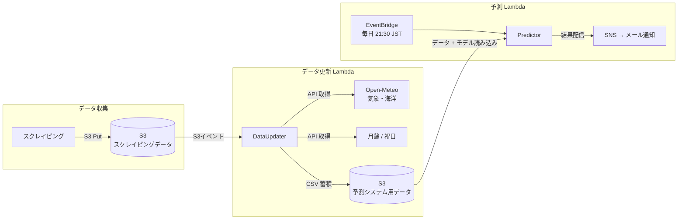

# 釣果予測システム (Fishing Catch Predictor)

機械学習を使って「明日、釣りに行くべきか？」を毎日自動で判定し、メールで通知するシステム。

横浜市の海釣り施設（本牧・大黒）を対象に、過去の釣果実績・気象・海洋・月齢データから翌日のアジ釣果数を予測し、釣行の推奨判定を配信する。

> [!NOTE]
> このリポジトリには予測モデルの学習用ファイルとWebから釣果データを取得するファイルは含まれていません。

## 背景

釣果は天候・水温・潮汐・季節など複数の要因に左右される。「なんとなく良さそうな日」に行って坊主だった経験から、データに基づいて判断できる仕組みを作りたいと考えた。

## 主な機能

- **翌日の釣果予測**:「1人あたりアジ釣果数」を予測し、閾値ベースで釣行を推奨
- **メール通知**: 毎日 21:30 (JST) に予測結果と直近の実績データを自動配信

## アーキテクチャ



データ更新処理はスケジュール実行ではなく、スクレイピングデータの S3 Put をトリガーに自動起動するイベント駆動の設計を採用している。データが到着したタイミングで即座に処理が走るため、スケジュールの調整が不要。

## 技術スタック

| カテゴリ | 技術 |
|---|---|
| ML | LightGBM, scikit-learn, Optuna |
| データ処理 | pandas, NumPy |
| インフラ | AWS SAM, AWS Lambda, Amazon S3, Amazon EventBridge, Amazon SNS |
| 外部データ | Open-Meteo API（気象・海洋）, Astral（月齢）, holidays-jp（祝日） |
| 言語・ツール | Python 3.12, uv, pytest |

## 特徴量設計

予測精度を高めるために、以下のカテゴリの特徴量を設計した。

| カテゴリ | 例 | 意図 |
|---|---|---|
| ラグ特徴量 | 1〜28日前の釣果・来場者・水温 | 直近のトレンドと周期性を捉える |
| 移動統計 | 3/7/14/30日の移動平均・標準偏差・最大・最小 | 短期〜中期の傾向を平滑化して表現 |
| 水温勾配 | 1/3/7/14日間の水温変化率、上昇・下降フラグ | 水温が上昇傾向か下降傾向かで魚の活性が変わる |
| 季節性 | 月・週の sin/cos エンコーディング、前年同週平均 | 季節パターンを連続値として表現 |
| 月齢 | sin/cos エンコーディング、満月・新月フラグ | 潮汐と魚の活性の関係を表現 |
| 気象・海洋 | 風速・気圧・波高・うねりのラグと移動平均 | 過去数日の海況傾向から翌日の状況を推定 |
| 交互作用 | 釣果 × 水温、水温 × 月齢 など | 複数要因の組み合わせ効果を明示的に表現 |

## 通知サンプル

```
明日の釣果予測をお届けします。

📅 予測日: 2026-04-24

━━━━━━━━━━━━━━━━━━━━━━━━
🏠 本牧海づり施設
━━━━━━━━━━━━━━━━━━━━━━━━
🎣 予測釣果: 3.45 匹/人
✅ おすすめ: 釣りに行きましょう！

📊 直近の実績 (2026-04-23)
   来場者数: 320 人
   アジ釣果数: 1,200 匹
   1人あたり: 3.75 匹/人

🎯 予測精度 (全180日)
   適合率: 62/85 (73%)
   再現率: 62/95 (65%)

━━━━━━━━━━━━━━━━━━━━━━━━
🏠 大黒海づり施設
━━━━━━━━━━━━━━━━━━━━━━━━
🎣 予測釣果: 1.20 匹/人
❌ 見送り: 今回は見送りが無難です。

📊 直近の実績 (2026-04-23)
   来場者数: 210 人
   アジ釣果数: 280 匹
   1人あたり: 1.33 匹/人

🎯 予測精度 (全180日)
   適合率: 48/72 (67%)
   再現率: 48/80 (60%)

━━━━━━━━━━━━━━━━━━━━━━━━

※ この予測は過去データに基づく参考値です。
※ 天候や海況により実際の釣果は変動します。
```

## セットアップ

### 前提条件

- AWS アカウント / AWS CLI 設定済み
- Docker
- Python 3.12+, uv
- SAM CLI

### デプロイ

```bash
# 依存関係インストール
uv sync

# ビルド & デプロイ
sam build && sam deploy
```
